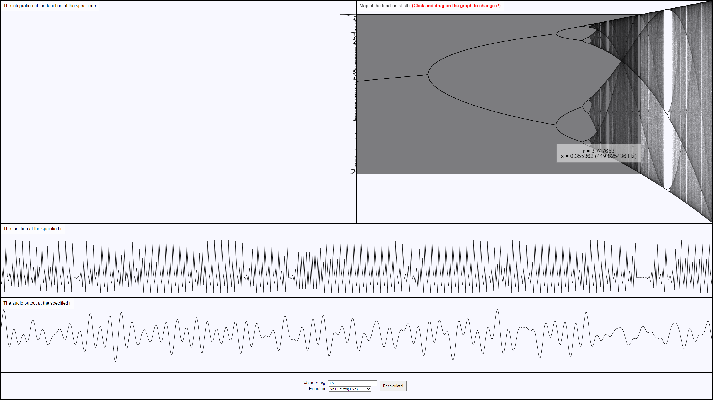

An online logistic map visualization and sonification, live at [https://onerandomgithubuser.github.io/Online-Logistic-Map/](https://onerandomgithubuser.github.io/Online-Logistic-Map/)

# Features

Screenshot of the program in action. The logistic map is shown, with a specific value of r able to be shown. The integration at that r as a function of x, the function at that r as a function of n, and the audio output at that r as a function of n are shown. x0 and the function done at each iteration can be adjusted.

# Compiling from source

To compile from source, first [download and install Emscripten](https://emscripten.org/docs/getting_started/downloads.html). Then run either `scripts/emcc_release_powershell.bat` or `scripts/emcc_release_windows_terminal.bat`, which will compile in PowerShell or in Windows Terminal (from the Microsoft Store), respectively. To view the webpage, either view the [live webpage](https://onerandomgithubuser.github.io/Online-Logistic-Map/) or host the page locally. To host the page locally, install Python and run either `tools/server_local_installation_python.bat` if your Python is a local installation or `tools/server_windows_store_python.bat` if your Python is the Windows Store version. Then, go to `localhost:8000` in your favorite web browser. Compilation tools and instructions are currently Windows only, other OS shell scripts may come soon.

This program uses [FFTW 3.3.10](http://www.fftw.org/). If you wish to recompile FFTW (perhaps to update to a newer version), first download FFTW and extract it to a folder in the `lib` directory of the project. In a Linux system (running Ubuntu in Windows Terminal after downloading and installing the Windows Subsystem for Linux will work for Windows), install Emscripten (if you are on Windows, it will need to be installed separately for the Linux subsystem), install make, and [precompile the library using Emscripten](https://emscripten.org/docs/compiling/Building-Projects.html). Find the precompiled library in `fftw-3.3.10/.libs` (should be the largest file) and update the file paths in the compilation batch scripts if necessary. Optionally, rename `fftw-3.3.10/.libs` folders to `fftw-3.3.10/libs` to avoid Git errors from the period and add .libs to .gitignore to avoid Git errors from the empty .la files.

Tested using Python 3.12.
